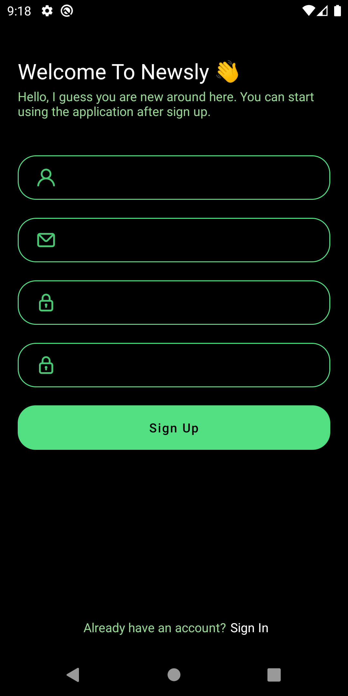
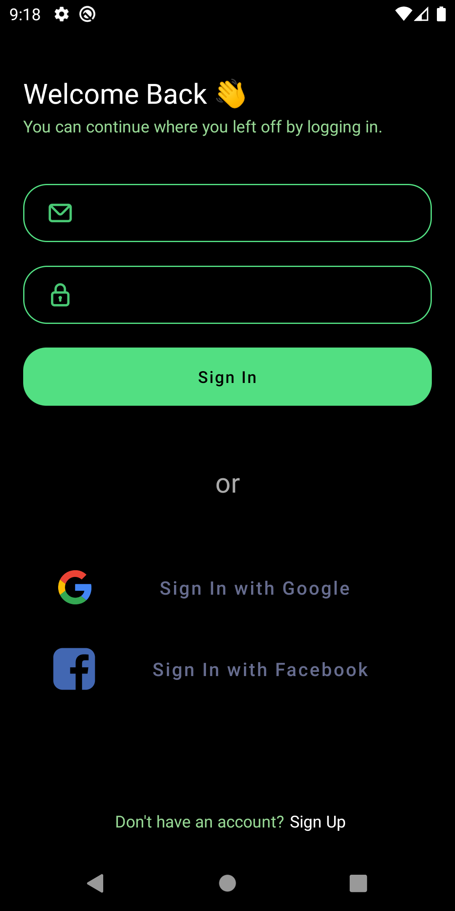
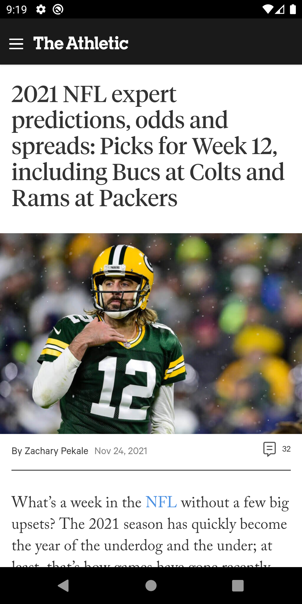
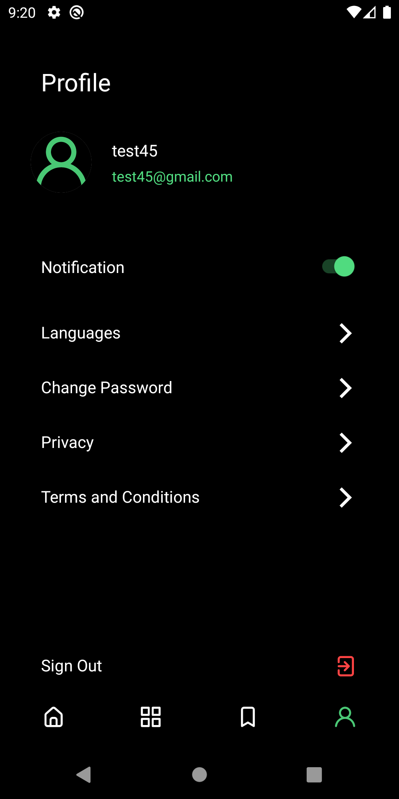

# Newsly
Is news app that build using android and firebase with sqlite as local database for our moblie appplication project

## 🎯 Our feature 
* User profile
* User Auth with firebase 🔥
* Fetch the latest news 📰
* Save you fav article


## 🏋🏽‍♂️ Resource we used
- Java
- Android
- Firebase
- sqlite
- News Api

## Getting Started

**Follow the following setps to run project in local machine **


To get a local copy up and running follow these simple example steps.

### Prerequisites
- know some java ☕️

### Clone the project
- ```git clone https://github.com/Azizadx/Newsly.git```

### Install
- [Android Studio](https://developer.android.com/studio/install)

### Usage
- open the clone project in android studio
- Run the project

### News app read to use


### Final result
* Intro pages
 - 
 - 
* Signup page
 - 
* Login page
 - 
* Main page with different categories
 - 
 - 
 - 
* News in webview 
 - 
 - 
* Profile page
 - 
* Change password
 - 


## Authors

👤 **Nasrallah**

- GitHub: [@githubhandle](https://github.com/Azizadx)

👤 **Mika**

- GitHub: [@githubhandle](https://github.com/mikatakashi)
  
👤 **Meryem**

- GitHub: [@githubhandle](https://github.com/meryem00)
  
👤 **Mekdedi**

- GitHub: [@githubhandle](https://github.com/mekedi-mkt)


 ## Acknowledgments 🙏

- [UI/UX](https://figmaelements.com/news-app-ui-kit/)

## 🙌 Want to Contribute?

* 🐛 [Report an issue](../../issues/)


## Show your support
- if you want to help to get jobs
  


## 📝 License

This project is [MIT](./MIT.md) licensed.


